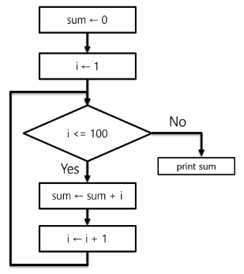
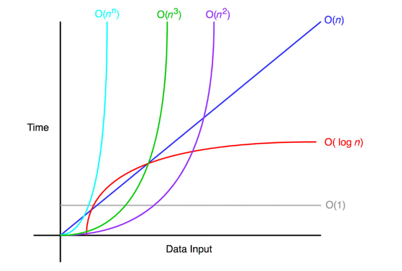

# 알고리즘

**알고리즘** : 유한한 단계를 통해 문제를 해결하기 위한 절차나 방법이다. 주로 컴퓨터용어로 쓰이며, 컴퓨터가 어떤 일을 수행하기 위한 단계적 방법을 말한다.

→ 간단하게 다시 말하면 어떠한 문제를 해결하기 위한 절차라고 볼 수 있다.

- 컴퓨터 분야에서 알고리즘을 표현하는 방법은 크게 두가지

  - 의사코드(슈도코드, Pseudocode)
    ```python
    # 슈도코드 예시
    CalcSum(n)
    	sum <- 0
    	for i : 1 -> n
    		sum <- sum + i
    	return sum;
    ```
  - 순서도
    

- 무엇이 좋은 알고리즘인가?

  1. 정확성 : 얼마나 정확하게 동작하는가
  2. 작업량 : 얼마나 적은 연산으로 원하는 결과를 얻어내는가
  3. 메모리 사용량 : 얼마나 적은 메모리를 사용하는가
  4. 단순성 : 얼마나 단순한가
  5. 최적성 : 더 이상 개선할 여지없이 최적화되었는가

- 시간 복잡도 (Time Complexity)
  - 실제 걸리는 시간을 측정
  - 실행되는 명령문의 개수를 계산
  - 알고리즘의 작업량을 표현할 때 시간복잡도로 표현한다.
    | 알고리즘1 | 알고리즘2 |
    | -------------- | --------- |
    | `def CalcSum(n)` | `def CalcSum(n)` |
    | `sum <- 0 # 1번` | `return n*(n+1)//2 # 3번` |
    | `for i : 1 -> n # n번` |
    | `sum <- sum + i # n` |
    | `return sum;` |
    | 1 + n\*2 = 2n + 1 | 3번의 연산 |
- 시간 복잡도 ≒ 빅 오(O) 표기법
  - 빅-오 표기법 (Big-Oh Notation)
  - 시간 복잡도 함수 중에서 가장 큰 영향력을 주는 n에 대한 항만을 표시
  - 계수 (Coefficient)는 생략하여 표시
  - 예를 들어
    O(3n + 2) = O(3n) = O(n)
    O(2n^2 + 10n + 100) = O(n^2)
    O(4) = O(1)
  - n개의 데이터를 입력 받아 저장한 후 각 데이터에 1씩 증가시킨 후 각 데이터를 화면에 출력하는 알고리즘의 시간복잡도는 어떻게 되나? → O(n)
  - 요소 수가 증가함에 따라 각기 다른 시간복잡도의 알고리즘은 아래와 같은 연산 수를 보인다.
    
