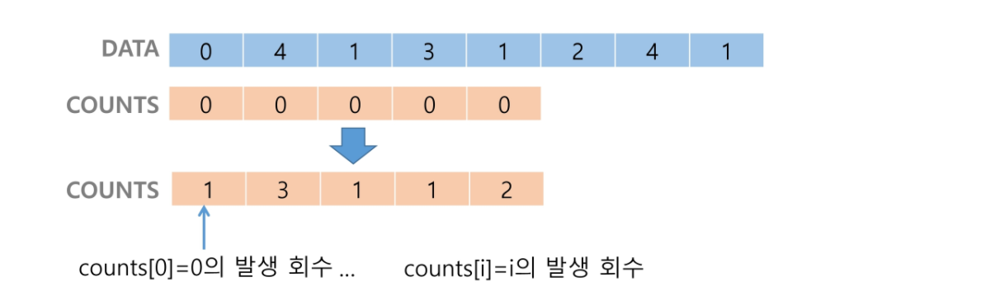
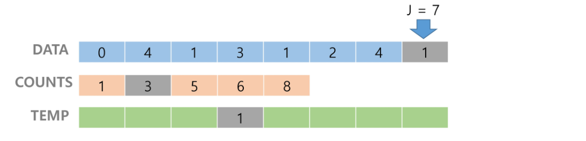
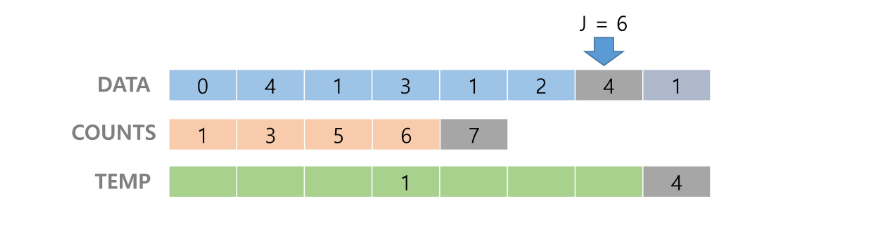
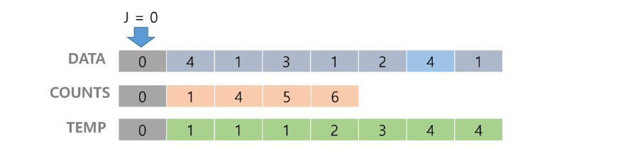

# 버블 정렬 (Bubble Sort)
    
버블 정렬 : 인접한 두 개의 원소를 비교하여 자리를 계속 교환하는 방식

- 정렬 과정
    - 첫 번째 원소부터 인접한 원소끼리 계속 자리를 교환하면서 맨 마지막 자리까지 이동한다.
    - 한 단계가 끝나면 가장 큰  원소가 마지막 자리로 정렬된다.
    - 교환하며 자리를 이동하는 모습이 물 위에 올라오는 거품 모양과 같다고 하여 버블 정렬이라고 한다.
    - 시간 복잡도 : O(n^2)
- 배열을 활용한 버블 정렬
    - 앞서 살펴본 정렬 과정을 코드로 구현하면 아래와 같다. (오름차순)
        
        ```python
        # 슈도코드
        BubbleSort(a, N)         # 정렬할 배열과 배열의 크기
            for i : N-1 -> 1       # 정렬될 구간의 끝
                for j : 0 -> i-1     # 비교할 원소 중 왼쪽 원소의 인덱스
                    if a[j] > a[j+1]   # 왼쪽 원소가 더 크면
                        a[j] <-> a[j+1]  # 오른쪽 원소와 교환
        ```
        
        ```python
        def BubbleSort(a, N):         # 정렬할 List, 원소 수
            for i in range(N-1, 0, -1): # 범위의 끝 위치
                for j in range(0, i):
                    if a[j] > a[j+1]:
                        a[j], a[j+1] = a[j+1], a[j]
        ```
            
# 카운팅 정렬 (Counting Sort)
    
카운팅 정렬 : 항목들의 순서를 결정하기 위해 집합에 각 항목이 몇 개씩 있는지 세는 작업을 하여, 선형 시간에 정렬하는 효율적인 알고리즘

- 제한 사항
    - 정수나 정수로 표현할 수 있는 자료에 대해서만 적용 가능 : 각 항목의 발생 횟수를 기록하기 위해, 정수 항목으로 인덱스 되는 카운트들의 배열을 사용하기 때문이다.
    - 카운트들을 위한 충분한 공간을 할당하려면 집합 내의 가장 큰 정수를 알아야 한다.
- 시간 복잡도 : O(n+k) : n은 리스트 길이, k는 정수의 최대값
- 정렬과정
    
    ex) [0, 4, 1, 3, 1, 2, 4, 1]을 카운팅 정렬하는 과정
    
    
    
    1. 0부터 Data의 최대값의 길이를 크기로 하는 counts 배열을 만드는데, counts의 각 원소의 값은 인덱스에 해당하는 원소가 Data에 얼마나 존재하는지 나타내준다.
    2. 정렬된 집합에서 **각 항목의 앞에 위치할 항목의 개수를 반영하기 위해** counts의 원소를 누적합으로 조정한다.
    
    
    
    3. 숫자를 정렬시켜 놓을 리스트 temp를 만들고 Data의 맨 오른쪽부터 값을 하나씩 뽑은 후 이를 인덱스로 하는 counts의 값을 다시 temp의 인덱스에 넣고, 해당 값을 Data에서 뽑은 값으로 준다.
    
    
    
    4. 이어서 Data의 왼쪽 값으로 이동한 후 값을 하나 뽑고, 이를 인덱스로 하는 counts의 값을 다시 temp의 인덱스에 넣고, Data에서 뽑은 값을 다시  temp에 넣어준다.
    
    
    
    5. 위 방법을 0번째 인덱스까지 반복한다.
- 코드
    
    ```python
    def Counting_Sort(A, B, k):
        # A [ ] -- 입력 배열 (0 to k)
        # B [ ] -- 정렬된 배열
        # C [ ] -- 카운트 배열
    
        C = [0] * (k+1)
    
        for i in range(0, len(A)):
            C[A[i]] += 1
    
        for i in range(1, len(C)):
            C[i] += C[i+1]
    
        for i in range(len(B)-1, -1, -1):
            C[A[i]] -= 1
            B[C[A[i]]] = A[i]
    ```