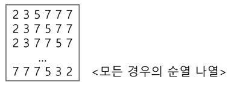
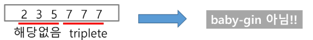
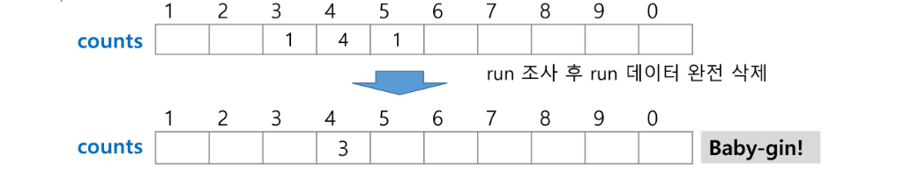
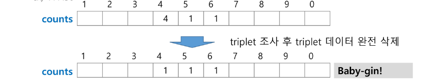

# 완전검색

  - 완전 검색 방법 : 문제의 해법으로 생각할 수 있는 모든 경우의 수를 나열해보고 확인하는 기법이다. (Brute-force 혹은 generate-and-test 기법이라고도 불리운다.)
      - 모든 경우의 수를 테스트한 후, 최종 해법을 도출한다.
      - 일반적으로 경우의 수가 상대적으로 작을 때 유용하다.
      - 모든 경우의 수를 생성하고 테스트하기 때문에 수행 속도는 느리지만, 해답을 찾아내지 못할 확률이 작다.
      - 자격검정평가 등에서 주어진 문제를 풀 때, 우선 완전 검색으로 접근하여 해답을 도출한 후, 성능 개선을 위해 다른 알고리즘을 사용하고 해답을 확인하는 것이 바람직하다.
  - 완전 검색을 활용한 baby-gin접근
      - 고려할 수 있는 모든 경우의 수 생성하기
          
          ex) 입력으로 [2, 3, 5, 7, 7, 7]을 받았을 경우, 아래와 같이 순열을 생성할 수 있다.
          
          
          
      - 해답 테스트하기
          - 앞의 3자리와 뒤의 3자리를 잘라, run과 triplet여부를 테스트하고 최종적으로 baby-gin을 판단한다.
              
              ex)
              
              
              
        
# 그리디 (Greedy Algorithm)

  - 탐욕(Greedy) 알고리즘 : 최적해를 구하는데 사용되는 근시안적인 방법
      - 여러 경우 중 하나를 결정해야 할 때마다 그 순간에 최적이라고 생각되는 것을 선택해 나가는 방식으로 진행하여 최종적인 해답에 도달한다.
      - 각 선택의 시점에서 이루어지는 결정은 지역적으로는 최적이지만, 그 선택들을 계속 수집하여 최종적인 해답을 만들었다고 하여, 그것이 최적이라는 보장은 없다.
      - 일반적으로, 머릿속에 떠오르는 생각을 검증 없이 바로 구현하면 Greedy 접근이 된다.
  - 그리디의 동작과정
      1. 해 선택 : 현재 상태에서 부분 문제의 최적 해를 구한 뒤, 이를 부분해 집합(Solution Set)에 추가한다.
      2. 실행 가능성 검사 : 새로운 부분해 집합이 실행 가능한지를 확인한다. 곧, 문제의 제약 조건을 위반하지 않는지를 검사한다.
      3. 해 검사 : 새로운 부분해 집합이 문제의 해가 되는지를 확인한다. 아직 전체 문제의 해가 완성되지 않았다면 1.의 해 선택부터 다시 시작한다.
  - baby-gin을 그리디로 풀이해보자
      
      ex) 444345
      
      
      
      ex) 444456
      
      
      
      - 구현 예
          
          ```python
          num = 456789 # Baby Gin 확인할 6자리 수 
          c = [0] * 12 # 6자리 수로부터 각 자리 수를 추출하여 개수를 누적할 리스트
          
          for i in ragne(6):
            c[num % 10] += 1
            num //= 10
          
          i = 0
          tri = run = 0
          while i < 10:
            if c[i] >= 3: # triplete 조사 후 데이터 삭제
              c[i] -= 3
              tri += 1
              continue;
            if c[i] >= 1 and c[i+1] >= 1 and c[i+2] >= 1: # run 조사 후 데이터 삭제
              c[i] -= 1
              c[i+1] -= 1
              c[i+2] -= 1
              run += 1
              continue
            i += 1
          
          if run + tri == 2: print("Baby Gin")
          else: print("Lose")
          ```
          
      - 자주 실수하는 오답
          - 입력받은 숫자를 정렬한 후, 앞 뒤 3자리씩 끊어서 run 및 triplet을 확인하는 방법을 고려할 수도 있다.
              
              ex) [6, 4, 4, 5, 4, 4]
              
              → 정렬하여 [4, 4, 4, 4, 5, 6]을 얻어 내면 쉽게 baby-gin을 확인할 수 있다.
              
              ex) [1, 2, 3, 1, 2, 3]
              
              → 정렬하면 [1, 1, 2, 2, 3, 3]로서, 오히려 baby-gin확인을 실패할 수도 있다.
              
          - 위의 예처럼, 탐욕 알고리즘적인 접근은 해답을 찾아내지 못하는 경우도 있으니 유의해야 한다.