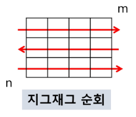
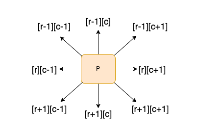

# 배열 : 2차원 배열

- 2차원 배열의 선언
- 1차원 List를 묶어놓은 List
- 2차원 이상의 다차원 List는 차원에 따라 Index를 선언
- 2차원 List의 선언 : 세로길이 (행의 개수), 가로길이 (열의 개수)를 필요로 함
- Python에서는 데이터 초기화를 통해 변수선언과 초기화가 가능함
  `arr = [[0, 1, 2, 3], [4, 5, 6, 7]]` (2행 4열의 2차원 List)
  | 0 | 1 | 2 | 3 |
  | --- | --- | --- | --- |
  | 4 | 5 | 6 | 7 |
- 2차원 리스트 입력 받기

```python
"""
3
1 2 3
4 5 6
7 8 9
"""
N = int(input())
arr = [list(map(int, input().split())) for _ in range(N)]

"""
3
123
456
789
"""
N = int(input())
arr = [list(map(int, input())) for _ in range(N)]
```

- 배열 순회
- n _ m 배열의 n _ m개의 모든 원소를 빠짐없이 조사하는 방법
- 행 우선 순회
  ```python
  # i 행의 좌표
  # j 열의 좌표
  for i in range(n):
  for j in range(m):
      f(Array[i][j]) # 필요한 연산 수행
  ```
- 열 우선 순
  ```python
  # i 행의 좌표
  # j 열의 좌표
  for i in range(m):
  for j in range(n):
      f(Array[i][j]) # 필요한 연산 수행
  ```
- 지그재그 순회

  

  ```python
  # i 행의 좌표
  # j 열의 좌표
  for i in range(n):
  for j in range(m):
      f(Array[i][j + (m-1-2*j) * (i%2)])
  ```

- 델타를 이용한 2차 배열 탐색

  - 2차 배열의 한 좌표에서 4방향의 인접 배열 요소를 탐색하는 방법

    

  ```python
  # arr는 N*N 배열
  di <- [0, 1, 0, -1]
  dj <- [1, 0, -1, 0]

  for i : 0 -> N-1
      for j : 0 -> N-1
          for k in range(4)
              ni <- i + di[k]
              nj <- j + dj[k]
              if 0 <= ni < N and 0 <= nj < N # 유효한 인덱스면
                  f(arr[ni][nj])
  ```

- 전치 행렬 (matrix Transpose)

  ```python
  # i : 행의 좌표, len(arr)
  # j : 열의 좌표, len(arr[0])
  arr = [[1, 2, 3], [4, 5, 6], [7, 8, 9]] # 3*3 행렬

  for i in range(3):
  for j in range(3):
      if i < j:
          arr[i][j], arr[j][i] = arr[j][i], arr[i][j]
  ```
