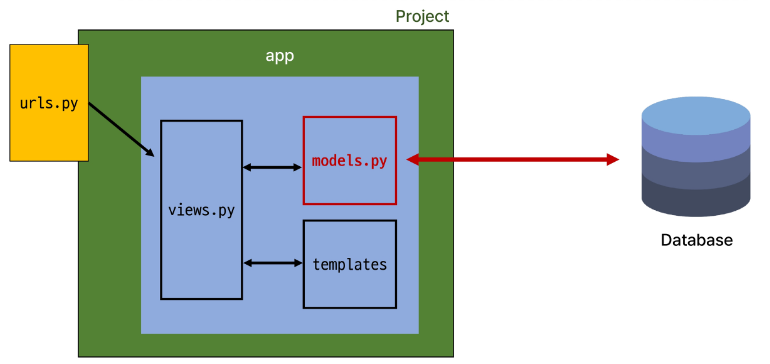
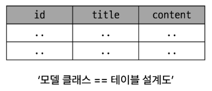
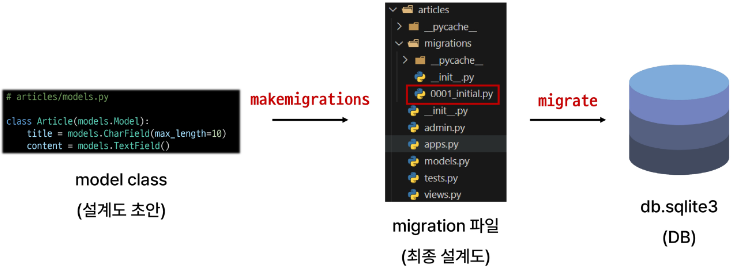

# Model
    
Model ≠ Database

Model을 통한 DB(데이터베이스) 관리



Django Model : DB의 테이블을 정의하고 데이터를 조작(생성/수정/삭제)할 수 있는 기능들을 제공

→ 테이블 구조를 설계하는 ‘청사진(blueprint)’

**model 클래스 작성**

```python
# articles/models.py
from django.db.models import models

class Article(models.Model): # django.db.models 모듈의 Model이라는 부모 클래스를 상속 받음
    # 클래스 변수명 : 테이블의 각 "필드(열) 이름"
    # model Field 클래스 : 테이블 필드의 "데이터 타입"
    # model Field 클래스의 키워드 인자 (필드 옵션) : 테이블 필드의 "제약조건" 관련 설정
    title = models.CharField(max_length=10)
    content = models.TextField()
```

작성한 모델 클래스는 최종적으로 DB에 다음과 같은 테이블 구조를 만듦



**제약조건**

: 데이터가 올바르게 저장되고 관리되도록 하기 위한 규칙

ex) 숫자만 저장되도록, 문자가 100자까지만 저장되도록 하는 등
    
# Migrations
    
**Migrations** : model 클래스의 변경사항 (필드 생성, 수정, 삭제 등)을 DB에 최종 반영하는 방법

**Migrations과정**



⭐**Migrations 핵심 명령어 2가지⭐**

`$ python [manage.py](http://manage.py) makemigrations`

: model class를 기반으로 최종 설계도(migration) 작성

`$ python [manage.py](http://manage.py) migrate`

: 최종 설계도를 DB에 전달하여 반영

**model class에 변경사항(1)이 생겼다면, 반드시 새로운 설계도를 생성(2)하고, 이를 DB에 반영(3)해야 한다.**

1. model class 변경 → 2. makemigrations → 3. migrate

### Model Field

: DB 테이블의 필드(열)을 정의하며, 해당 필드에 저장되는 데이터 타입과 제약조건을 정의

- `charField()`
    - 길이의 제한이 있는 문자열을 넣을 때 사용 (필드의 최대 길이를 결정하는 max_length는 필수 인자)
- `TextField()`
    - 글자의 수가 많을 때 사용
    - 무한은 아닌데, 딱히 제한을 두지는 않음
- `DateTimeField()`
    - 날짜와 시간을 넣을 때 사용
    - DateTimeField의 선택인자
        - `auto_now` : 데이터가 **저장될 때마다** 자동으로 현재 날짜시간을 저장 (수정일)
        - `auto_now_add` : 데이터가 **처음 생성될 때만** 자동으로 현재 날짜 시간을 저장 (작성일)

# Admin site
    
**Automatic admin interface**

: Django는 추가 설치 및 설정 없이 자동으로 관리자 인터페이스를 제공

→ 데이터 확인 및 테스트 등을 진행하는데 매우 유용

admin 계정 생성

- email은 선택사항이기 때문에 입력하지 않고 진행 가능
- 비밀번호 입력 시 보안상 터미널에 출력되지 않으니 무시하고 입력 이어가기
- `$ python [manage.py](http://manage.py) createsuperuser`

[안전한 패스워드 저장](https://d2.naver.com/helloworld/318732)