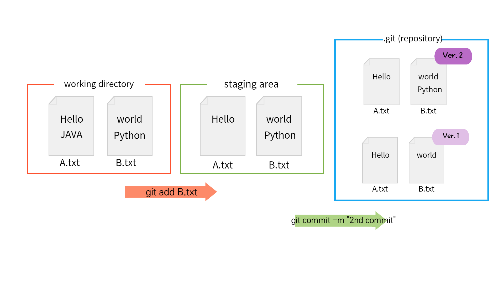

# GIT
***: 분산 버전 관리 시스템***

버전관리 ? → 변화를 기록하고 추적하는 것

분산 ? → 버전을 여러 개의 복제된 저장소에 저장 및 관리

    분산vs 중앙집중식 : 버전은 중앙서버에 저장되고, 중앙 서버에서 파일을 가져와 다시 중앙에 업로드 ex) svn

∴ git의 역할

1. 코드의 버전(히스토리)를 관리
2. 개발되어 온 과정 파악
3. 이전 버전과의 변경 사항 비교

---
### git의 영역

1. **Working Directory**
    
    : 실제 작업 중인 파일들이 위치하는 영역
    
2. **Staging Area**
    
    : Working Directory에서 변경된 파일 중, 다음 버전에 포함시킬 파일들을 선택적으로 추가하거나 제외할 수 있는 중간 준비 영역.
    
3. **Repositories**
    
    : 버전 이력과 파일들이 영구적으로 저장되는 영역. 모든 버전과 변경 이력이 기록됨

</img>
        
        Untracked    →    Modified    →    Nothing to commit, working tree clean
        
        Modified    →    Modified    →    Nothing to commit, working tree clean

버전 == **Commit**

Commit : 변경된 파일들을 저장하는 행위이며, 마치 사진을 찍듯이 기록한다 하여 ‘snapshot’이라고도 함

---

### git의 동작

- `git init`
    
    : 로컬 저장소 설정 (초기화)
    
    → git의 버전 관리를 할 디렉토리를 지정
    
- 🌟`git add 파일명`
    
    : 변경사항이 있는 파일을 staging area에 추가
    
- `git restore`
    
    : 수정사항 취소, 가장 최근의 commit 상태로 되돌아감
    
- `git restore --staged`
    
    : staging → w.d로 내리기 위해 사용
    
- `git rm`
    
    : 더 이상 해당 file을 git으로 관리하지 않을때
    
- `git rm --cached 파일명`
    
    : 처음으로 등록되는 파일의 경우 버전관리대상목록에서 제외할때 사용
    
- 🌟`git commit -m “변경내용”`
    
    : staging area에 있는 파일들을 저장소에 기록
    
    → 해당 시점의 버전을 생성하고 변경 이력을 남기는 것
    

- 🌟`git status`
    
    : 현재 로컬 저장소의 파일 상태 확인 (초록>staging 빨강>working directory) 
    
- `git log`
    
    : commit history 확인 
    
- `git log --oneline`
    
    : commit 목록 한 줄로 보기
    
- `git diff A커밋해시 B커밋해시`
    
    : A커밋과 B커밋의 차이 확인
    
- `git config —global -l`
    - git global 설정 정보 보기

> ***git init 주의사항!!***
> 
> 
> → git 로컬 저장소 내에 또다른 git 로컬 저장소를 만들지 말 것
> 
> 즉, 이미 git 로컬 저장소인 디렉토리 내부 하단에서 git init 명령어를 다시 입력하지 말 것
> 
> → git 저장소 안에 git 저장소가 있을 경우 가장 바깥 쪽의 git 저장소가 안쪽의 git 저장소의 변경사항을 추적할 수 없기 때문
> 

---

왜 굳이 staging area에 추가할까?

→ 관리의 편의를 위해!

우리에게 필요한 파일, 필요하지 않은 파일을 구분하기 위해 staging area가 존재함!

---

.gitignore는 첫 commit때 같이 올리자~

만약 이미 스테이징한, 아니면 커밋한 파일을 중간에 갑자기 gitignore에 등록되어야 한다면

`git rm --cached 파일명` > add > commit ~

개발환경에 따라 gitignore 작성해주는 서비스

[gitignore.io](https://www.toptal.com/developers/gitignore/)

***🌟git 이용 최종정리***

---

1. git init 
2. .gitignore생성
3. git add .
    1. git status (staging확인)
4. git commit -m “커밋내용”
5.  git push 리모트명 브랜치명