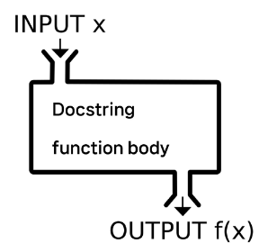
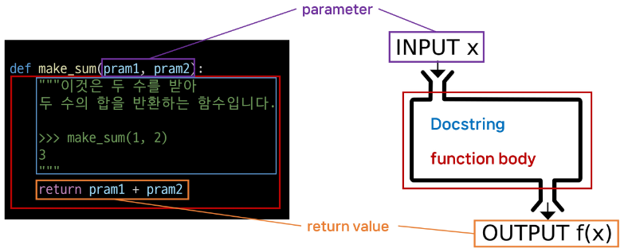
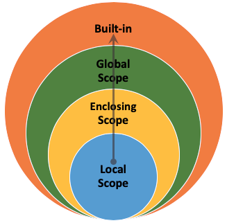

# Functions
    
## 함수
    
`함수 (Functions)` : 특정 작업을 수행하기 위한 재사용 가능한 코드 묶음
    
- 함수를 사용하는 이유
    - 두 수의 합을 구하는 함수를 정의하고 사용함으로써 코드의 중복을 방지
    - 재사용성이 높아지고, 코드의 가독성과 유지보수성 향상
            
            
        ```python
        # 두 수의 합을 구하는 코드
        num1 = 5
        num2 = 3
        sum_result = num1 + num2
        print(sum_result)
         ```
            
        ```python
        # 두 수의 합을 구하는 함수
        def get_sum(num1, num2):
        	return num1 + num2
            
        # 함수 사용하여 결과 출력
        num1 = 5
        num2 = 3
        sum_result = get_sum(num1, num2)
        print(sum_result)
        ```
            
    
`내장 함수 (Built-in function)` : 파이썬이 기본적으로 제공하는 함수 (별도의 import 없이 바로 사용 가능)
    
- 내장 함수 예시
    - 절대값을 만드는 함수
            
        ```python
        # abs 함수 호출의 반환값을 result에 할당
        result = abs(-1)
        print(result) # 1
        ```
            
    
`함수 호출 (function call)` : 함수를 실행하기 위해 함수의 이름을 사용하여 해당 함수의 코드 블록을 실행하는 것 `function_name(arguments)`
    
    
## 함수의 구조
    
```python
def make_sum(pram1, pram2):
    '''
    이것은 두 수를 받아
    두 수의 합을 반환하는 함수입니다.
    	
    >>> make_sum(1, 2)
    3
    '''
    return pram1 + pram2
```




## 함수의 정의와 호출
    
- 함수 정의 (정의)
    - 함수 정의는 def 키워드로 시작
    - def 키워드 이후에 함수 이름 작성
    - 괄호안에 매개변수를 정의할 수 있음
    - 매개변수 (parameter)는 함수에 전달되는 값을 나타냄
- 함수 body
    - 콜론 (:) 다음에 들여쓰기 된 코드 블록
    - 함수가 실행될 때 수행되는 코드를 정의
    - Docstring은 함수 body 앞에 선택적으로 작성 가능한 함수 설명서
- 함수 반환 값
    - 함수는 필요한 경우 결과를 반환할 수 있음
    - return 키워드 이후에 반환할 값을 명시
    - return 문은 함수의 실행을 종료하고, 결과를 호출 부분으로 반환
- 함수 호출
    - 함수를 호출하기 위해서는 함수의 이름과 필요한 인자(argument)를 전달해야 함
    - 호출 부분에서 전달된 인자는 함수 정의 시 작성한 매개변수에 대입됨
    
```python
def greet(name):
    '''
    입력된 이름 값에
    인사를 하는 메세지를 만드는 함수
    '''
    message  = 'Hello, ' + name
    return message # 함수 반환 값
    # 2번째 줄 부터 여기까지 함수 body
    
    # 함수 호출
    result = greet('Alice') # 함수 호출
    print(result)
```
<br><br><br>    
    
# 매개변수와 인자
    
`매개변수 (parameter)` : 함수를 정의할 때, 함수가 받을 값을 나타내는 변수
    
`인자 (argument)` : 함수를 호출할 때, 실제로 전달되는 값
    
- 매개변수와 인자 예시
        
    ```python
    def add_numbers(x,y): # x와 y는 매개변수 (parameter)
        result = x+ y
        return result
        
    a = 2
    b = 3
    sum_result = add_numbers(a,b) # a와 b는 인자 (argument)
    print(sum_result)
    ```
        
    
    
## 인자의 종류
    
1. `Positional Arguments (위치인자)`
    - 함수 호출 시 인자의 ***위치에 따라 전달***되는 인자
    - 위치인자는 함수 호출 시 반드시 값을 전달해야 함
            
        ```python
        def greet(name, age):
            print(f'안녕하세요, {name}님! {age}살이시군요.')
            
        greet('Alice', 25) # 안녕하세요, Alice님! 25살이시군요.
        ```
            
2. `Default Argument Values (기본 인자 값)`
    - 함수 정의에서 ***매개변수에 기본 값을 할당***하는 것
    - 함수 호출 시 인자를 전달하지 않으면, 기본값이 매개변수에 할당됨
            
        ```python
        def greet(name, age=30):
            print(f'안녕하세요, {name}님! {age}살이시군요.')
            
        greet('Bob') # 안녕하세요, Bob님! 30살이시군요.
        greet('Charlie', 40) # 안녕하세요, Charlie님! 40살이시군요.
        ```
            
3. `Keyword Arguments (키워드 인자)`
    - 함수 ***호출 시*** ***인자의 이름과 함께 값을 전달***하는 인자
    - 매개변수와 인자를 일치시키지 않고, 특정 매개변수에 값을 할당할 수 있음
    - 인자의 순서는 중요하지 않으며, 인자의 이름을 명시하여 전다
    - 단, 호출 시 키워드 인자는 위치 인자 뒤에 위치해야 함
            
        ```python
        def greet(name, age=30):
            print(f'안녕하세요, {name}님! {age}살이시군요.')
            
        greet(name='Dave', age=35) # 안녕하세요, Dave님! 35살이시군요.
        ```
            
4. `Arbitrary Argument Lists (임의의 인자 목록)`
    - ***정해지지 않은 개수의 인자를 처리***하는 인자
    - 함수 정의 시 매개변수 앞에 ‘*’를 붙여 사용하며, ***여러 개의 인자를 tuple로 처리***
            
        ```python
        def calculate_sum(*args):
            print(args)
            total = sum(args)
            print(f'합계: {total}')
            
        '''
        (1, 2, 3)
        합계: 6
        '''
        calculate_sum(1, 2, 3)
        ```
            
5. `Arbitrary Keyword Argument Lists (임의의 키워드 인자 목록)`
    - ***정해지지 않은 개수의 키워드 인자를 처리***하는 인자
    - 함수 정의 시 매개변수 앞에 ‘**’를 붙여 사용하며, ***여러 개의 인자를 dictionary로 묶어 처리***
            
        ```python
        def print_info(**kwargs):
            print(kwargs)
            
        print_info(name='Eve', age=30) # {'name' : 'Eve', 'age' : 30}
        ```
            
    
> **함수 인자 권장 작성순서**
> 
> - ***위치 → 기본 → 가변 → 키워드 → 가변 키워드***
> - 호출 시 인자를 전달하는 과정에서 혼란을 줄일 수 있도록 함
> - 단, 모든 상황에 적용되는 절대적인 규칙은 아니며, 상황에 따라 유연하게 조정될 수 있음 (근데 위치인자는 무조건 맨 앞에!!!)
> 
> ```python
> def func(pos1, pos2, default_arg='default', *args, kwd, **kwargs):
> 	…
> ```
> 
<br><br><br>

# 함수와 Scope
- Python의 범위(Scope)
    - 함수는 ***코드 내부에 local scope***를 생성하며, ***그 외 공간인 global scope***로 구분
    - scope
        - `global scope` : 코드 어디에서든 참조할 수 있는 공간
        - `local scope` : ***함수가 만든*** scope (함수 내부에서만 참조 가능)
    - variable
        - global variable : global scope에 정의된 변수
        - local variable : local scope에 정의된 변수
    - scope 예시
        - num은 local scope에 존재하기 때문에 global에서 사용할 수 없음
        - 이는 변수의 수명주기와 연관이 있음
            
        ```python
        def func():
            num = 20
            print('local', num) # local 20
            
        func()
            
        print('global', num) # NameError : name 'num' is not defined
        ```
            
    
- ***변수 수명주기(lifecycle)***
    - 변수의 수명주기는 변수가 선언되는 위치와 스코프에 따라 결정됨
    1. built-in scope
        - 파이썬이 실행된 이후부터 영원히 유지
    2. global scope
        - 모듈이 호출된 시점 이후 혹은 인터프리터가 끝날때까지 유지
    3. local scope
        - 함수가 호출될 때 생성되고, 함수가 종료될 때까지 유지
    
- 이름 검색 규칙 (Name Resolution)
    - 파이썬에서 사용되는 이름(식별자)들은 특정한 이름공간(namespace)에 저장되어 있음
    - **아래와 같은 순서로 이름을 찾아 나가며**, `LEGB Rule`이라고 부름
        1. Local scope : 지역 범위 (현재 작업 중인 범위)
        2. Enclosed scope : 지역 범위 한 단계 위 범위 (함수 안의 함수일때 생김)
        3. Global scope : 최상단에 위치한 범위
        4. Built-in scope : 모든 것을 담고 있는 범위 (정의하지 않고 사용할 수 있는 모든 것)
    - 함수 내에서는 바깥 Scope의 변수에 접근 가능하나 수정은 할 수 없음
    - 밖으로는 찾아올라갈 수 있으나, 안으로는 못 찾아들어감.
            
        
            
- LEGB Rule 예시
    - sum이라는 이름을 global scope에서 사용하게 되면서 기존에 built-in scope에 있던 내장함수 sum을 사용하지 못하게 됨
    - sum을 참조 시 LEGB Rule에 따라 global에서 먼저 찾기 때문
            
        ```python
        print(sum) # <built-in function sum>
        print(sum(range(3))) # 3
            
        sum = 5
            
        print(sum) # 5
        print(sum(range(3))) # TypeError : 'int' object is not callable
        # 이 경우 sum변수 객체 삭제를 위해 del sum 을 입력 후 진행
        ```
            
        
    ```python
    a = 1
    b = 2
        
    def enclosed():
        a = 10
        c = 3
        	
        def local(c):
        	print(a, b, c) # 10 2 500
        	
        local(500)
        print(a, b, c) # 10 2 3
        
    enclosed()
    print(a, b) # 1 2
    ```
        
    
- `global` 키워드
    - 변수의 스코프를 전역 범위로 지정하기 위해 사용
    - 일반적으로 함수 내에서 전역 변수를 수정하려는 경우에 사용
            
        ```python
        num = 0 # 전역 변수
            
        def increment():
            global num # num을 전역 변수로 선언
            num += 1
            
        print(num) # 0
        increment()
        print(num) # 1
        ```
            
    - `global` 키워드 주의사항
        - global 키워드 선언 전에 접근 시
                
            ```python
            num = 0
                
            def increment():
                # SyntaxError : name 'num' is used prior to global declaration
                print(num)
                global num
                num += 1
            ```
                
        - 매개변수에 global 사용 불가
                
            ```python
            num = 0
                
            def increment(num):
                # 'num' is assigned before global declaration
                global num
                num += 1
            ```
                
        
    global 키워드는 가급적 사용하지 않는 것을 권장
        
    함수로 값을 바꾸고자 한다면 항상 인자로 넘기고 함수의 반환값을 사용하는 것을 권장
<br><br><br>

# 재귀 함수
    
재귀 함수 : 함수 내부에서 자기 자신을 호출하는 함수
    
> 재귀 함수 특징
> 
> - 특정 알고리즘 식을 표현할 때 변수의 사용이 줄어들며, 코드의 가독성이 높아짐
> - 1개 이상의 base case (종료되는 상황)가 존재하고, 수렴하도록 작성
- 재귀 함수 예시 - 팩토리얼
        
    $$
    n! = n * (n-1) * … * 2 * 1
    $$
        
    - factorial 함수는 자기 자신을 재귀적으로 호출하여 입력된 숫자 n의 팩토리얼을 계산
    - 재귀 호출은 n이 0이 될 때까지 반복되며, 종료 조건을 설정하여 재귀 호출이 멈추도록 함
    - 재귀 호출의 결과를 이요하여 문제를 작은 단위의 문제로 분할하고, 분할된 문제들의 결과를 조합하여 최종 결과를 도출
            
        ```python
        def factorial(n):
            # 종료 조건 : n이 0이면 1을 반환
            if n == 0:
            	return 1
            # 재귀 호출 : n과 n-1의 팩토리얼을 곱한 결과를 반환
            return n * factorial(n-1)
            
        # 팩토리얼 계산 예시
        result = factorial(5)
        print(result) # 120
        ```
            
    
재귀함수는 
    
1. 종료 조건을 명확히
2. 반복되는 호출이 종료 조건을 향하도록
<br><br><br>

# 유용한 함수
    
## 유용한 내장 함수
    
- map과 zip 함수 알아보기
    - `map(function, iterable)`
        - 순회 가능한 데이터구조(iterable)의 모든 요소에 함수를 적용하고, 그 결과를 map object로 반환
                
            ```python
            numbers = [1, 2, 3]
            result = map(str, numbers)
                
            print(result) # <map object at 0x00000239C915D760>
            print(list(result)) # ['1', '2', '3']
            ```
                
    - `zip(*iterables)`
        - 임의의 iterable을 모아 튜플을 원소로 하는 zip object를 반환
                
            ```python
            girls = ['jane', 'ashley']
            boys = ['peter', 'jay']
            pair = zip(girls, boys)
                
            print(pair) # <zip object at 0x000001C76DE58700>
            print(list(pair)) # [('jane', 'peter'), ('ashley', 'jay)]
            ```
                
- `lambda` 함수
        
    : 이름 없이 정의되고 사용되는 **익명 함수**
        
    - lambda 함수 구조
            
        lambda 매개변수 : 표현식
            
        - lambda 키워드
                
            람다 함수를 선언하기 위해 사용되는 키워드
                
        - 매개변수
            - 함수에 전달되는 매개변수들
            - 여러 개의 매개변수가 있을 경우 쉼표로 구분
        - 표현식
            - 함수의 실행되는 코드 블록으로, 결과값을 반환하는 표현식으로 작성
    - lambda 함수 예시
        - ***간단한 연산이나 함수를 한 줄로 표현할 때*** 사용
        - ***함수를 매개변수로 전달하는 경우***에도 유용하게 사용
                
                
            ```python
            def addition(x, y):
                return x + y
                
            result = addition(3, 5)
            print(result) # 8
            ```
                
            ```python
            '''
            이렇게도 사용할 순 있으나
            이 경우엔 되도록이면 함수를 정의하고
            사용하기
            -> 람다는 매개변수로 사용하는등
            일회성으로 사용할때 사용!
            '''
            addition = lambda x, y: x + y
                
            result = addition(3, 5)
            print(result) # 8
            ```