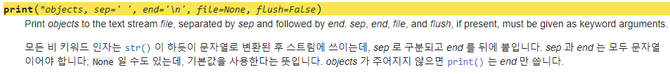

# Packing & Unpacking
    
## Packing
    
Packing (패킹) : 여러 개의 값을 하나의 변수에 묶어서 담는 것
    
- 패킹 예시
    - 변수에 담긴 값들은 튜플(tuple) 형태로 묶임
            
        ```python
        packed_values = 1, 2, 3, 4, 5
        print(packed_values) # (1, 2, 3, 4, 5)
        ```
            
- `*` 을 활용한 패킹
    - `*b`는 남은 요소들을 리스트로 패킹하여 할당
            
        ```python
        numbers = [1, 2, 3, 4, 5]
        a, *b, c = numbers
            
        print(a) # 1
        print(b) # [2, 3, 4]
        print(c) # 5
        ```
            
    - print 함수에 임의의 가변 인자를 작성할 수 있었던 이유
            
        → 따지자면 가변인자도 packing이다.
            
        
            
<br><br>  
    
## Unpacking
    
Unpacking (언패킹) : 패킹된 변수(list, tuple, str등)의 값을 개별적인 변수로 분리하여 할당하는 것
    
- 언패킹 예시
    - 튜플이나 리스트 등의 객체의 요소들을 개별 변수에 할당
    - 앞의 packing의 예시와 비슷해보일 수 있으나, 하나하나의 변수에 할당했으므로 unpacking
            
        ```python
        packed_values = 1, 2, 3, 4, 5
        a, b, c, d, e = packed_values
            
        print(a, b, c, d, e) # 1, 2, 3, 4, 5
        ```
            
- `*`을 활용한 언패킹
    - `*`는 리스트의 요소를 언패킹
            
        ```python
        names = ['alice', 'jane', 'peter']
        print(*names) # alice jane peter
        # print('alice', 'jane', 'peter')와 같은 거임
        ```
            
        
    > `***`의 사용 구분**
    > 
    > 
    > ***가변인자*** → 정의할때
    > 
    > ***unpacking*** → 호출할때
    > 
    > ```python
    > names = ['alice', 'jane', 'peter']
    > 
    > def my_func(*args): # 가변인자
    >     print(args)
    > 
    > my_func(names) # (['alice', 'jane', 'peter'],)
    > # unpacking
    > my_func(*names) # ('alice', 'jane', 'peter')
    > ```
    > 
- `**`을 활용한 언패킹
    - **는 딕셔너리의 ***키-값 쌍을 함수의 키워드 인자로 언패킹***
    - dict의 값만 풀어서 전달할 때 쓰인다.
            
        ```python
        def my_function(x, y, z):
            print(x, y, z)
            
        # 키워드 인자로 전달되기 때문에 매개변수명과 key값이 같아야 함
        my_dict = {'x':1, 'y':2, 'z':3}
        my_function(**my_dict) # 1 2 3
            
        my_dict2 = {'y':1, 'x':2, 'z':3}
        my_function(**my_dict2) # 2 1 3
            
        print(**my_dict2) # TypeError: 'y' is an invalid keyword argument for print()
        # 키워드 인자로 전달되기 때문에 print 매개변수에 y가 없어서 TypeError가 뜸
        ```
            
        
    > `***`*의 사용 구분**
    > 
    > 
    > ***가변키워드인자*** → 정의할때
    > 
    > ***unpacking*** → 호출할때
    > 
    > ```python
    > def my_func2(**args):
    >     print(args)
    > 
    > my_dict = {
    >     'apple': '맛있어',
    >     'banana': '노란색',
    >     'coconut': '달콤해'
    > }
    > 
    > # dict의 key : value를 keyword 인자 형태로 전달
    > # (함수의 매개변수가 가변 키워드 인자이기 때문)
    > my_func2(**my_dict) # {'apple': '맛있어', 'banana': '노란색', 'coconut': '달콤해'}
    > my_func2(my_dict) # TypeError: my_func2() takes 0 positional arguments but 1 was given
    > ```
    > 
- `*`, `**` 패킹 / 언패킹 연산자 정리
    - `*`
        - 패킹 연산자로 사용될 때, 여러 개의 인자를 하나의 튜플로 묶는 역할
        - 언패킹 연산자로 사용될 때, 시퀀스나 반복 가능한 객체를 각각의 요소로 언패킹하여 함수의 인자로 전달
    - `**`
        - 언패킹 연산자로 사용될 때, 딕셔너리의 키-값 쌍을 키워드 인자로 언패킹하여 함수의 인자로 전달하는 역할