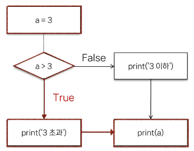
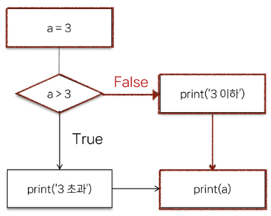

# 제어문
    
제어문 (Control Statement) : 코드의 실행 흐름을 제어하는 데 사용되는 구문, ***조건***에 따라 코드 블록을 실행하거나 ***반복***적으로 코드를 실행
    
# 조건문
    
조건문 (Conditional Statement) : 주어진 조건식을 평가하여 해당 조건이 참(True)인 경우에만 코드 블록을 실행하거나 건너뜀
    
- `if` statement
    - `if` statement의 기본 구조
            
        ```python
        if 표현식:
            	코드 블록
        elif 표현식:
            	코드 블록
        else:
            	코드 블록
        ```
            
    - 조건문 예시
            
            
        ```python
        a = 5
            
        if a > 3:
            print('3 초과')
        else:
            print('3 이하')
            
        print(a)
        ```
        
            
        ```python
        a = 3
            
        if a > 3:
            print('3 초과')
        else:
            print('3 이하')
            
        print(a)
        ```
        
            
    - 복수 조건문 예시
        - 조건식을 동시에 검사하는 것이 아니라 순차적으로 비교
                
            ```python
            dust = 35
                
            if dust > 150:
                print('매우 나쁨')
            elif dust > 80:
                print('나쁨')
            elif dust > 30:
                print('보통')
            else:
                print('좋음')
            ```
                
    - 중첩 조건문 예시
            
        ```python
        dust = 480
            
        if dust > 150:
            print('매우 나쁨')
            if dust > 300:
            	print('위험해요! 나가지 마세요!')
        elif dust > 80:
            print('나쁨')
        elif dust > 30:
            print('보통')
        else:
            print('좋음')
        ```
            
# 반복문
    
반복문 (Loop Statement) : 주어진 코드 블록을 여러 번 반복해서 실행하는 구문
    
1. 특정 작업을 반복적으로 수행 → `for`
2. 주어진 조건이 참인 동안 반복해서 실행 → `while`
- `for` statement
        
    `for` : 임의의 시퀀스의 항목들을 그 시퀀스에 들어있는 순서대로 반복
        
    - `for` statement의 기본 구조
            
        ```python
        for 변수 in 반복 가능한 객체:
            코드 블록
        ```
            
    - 반복 가능한 객체 (iterable)
            
        : 반복문에서 순회할 수 있는 객체 (시퀀스 객체 뿐만 아니라 dict(키 값이 전달됨), set 등도 포함)
            
        iterable ⊃ sequence
            
    - `for` 문 원리
        - 리스트 내 첫 항목이 반복 변수에 할당되고 코드블록이 실행
        - 다음으로 반복 변수에 리스트의 2번째 항목이 할당되고 코드블록이 다시 실행
        - …마지막으로 반복 변수에 리스트의 마지막 요소가 할당되고 코드블록이 실행
                
            ```python
            items = ['apple', 'banana', 'coconut']
                
            for item in items:
                print(item)
            """
            apple
            banana
            coconut
            """
            ```
                
    - 문자열 순회
            
        ```python
        country = 'Korea'
            
        for char in country:
            print(char)
            
        """
        K
        o
        r
        e
        a
        """
        ```
            
    - range 순회
            
        ```python
        for i in range(5):
            print(i)
            
        """
        0
        1
        2
        3
        4
        """
        ```
            
    - 인덱스로 리스트 순회
            
        ```python
        numbers = [4, 6, 10, -8, 5]
            
        for i in range(len(numbers)):
            numbers[i] = numbers[i] * 2
            
        print(numbers)
        ```
            
    - 중첩된 반복문
        - 안쪽 반복문은 outers 리스트의 각 항목에 대해 한 번씩 실행됨
        - print가 호출되는 횟수 ⇒ `len(outers) * len(inners)`
            
        ```python
        outers = ['A', 'B']
        inners = ['c', 'd']
            
        for outer in outers:
            for inner in inners:
            	print(outer, inner)
            
        """
        A c
        A d
        B c
        B d
        """
        ```
            
    - 중첩 리스트 순회
        - 안쪽 리스트 요소에 접근하려면 바깥 리스트를 순회하면서 중첩 반복을 사용해 각 안쪽 반복을 순회
                
            ```python
            elements = [['A', 'B'], ['c', 'd']]
                
            for elem in elements:
                print(elem)
                
            """
            ['A', 'B']
            ['c', 'd']
                """
                
            for elem in elements:
                for item in elem:
                	print(item)
                
            """
            A
            B
            c
            d
            """
            ```
                
- `while` statement
        
    `while` : 주어진 조건식이 참(True)인 동안 코드를 반복해서 실행 == ***조건식이 거짓(False)가 될 때 까지 반복***
        
    - `while` statement의 기본 구조
            
        ```python
        while 조건식:
            코드 블록
        ```
            
    - `while` 반복문 예시
            
        ```python
        a = 0
            
        while a < 3:
            print(a)
            a += 1
            
        print('끝')
            
        """
        0
        1
        2
        끝
        """
        ```
            
    - 사용자 입력에 따른 반복
        - while문을 사용한 특정 입력 값에 대한 종료 조건 활용하기
                
            ```python
            number = int(input('양의 정수를 입력해주세요. : '))
                
            while number <= 0:
                if number < 0:
                	print('음수를 입력했습니다.')
                else:
                	print('0은 양의 정수가 아닙니다.')
                	
                number = int(input('양의 정수를 입력해주세요. : '))
                
            print('잘했습니다!')
                
            """
            양의 정수를 입력해주세요. : 0
            0은 양의 정수가 아닙니다.
            양의 정수를 입력해주세요. : -1
            음수를 입력했습니다.
            양의 정수를 입력해주세요. : 1
            잘했습니다!
            """
            ```
                
    - ***while 문은 반드시 종료 조건이 필요***
- 적절한 반복문 활용하기
    - `for` → iterable의 요소를 하나씩 순회하며 반복
        - ***반복 횟수가 명확***하게 정해져 있는 경우에 유용
        - 예를 들어 리스트, 튜플, 문자열, 등과 같은 시퀀스 형식의 데이터를 처리할 때
    - `while` → 주어진 조건이 참인 동안 반복
        - ***반복 횟수가 불명확***하거나 조건에 따라 반복을 종료해야 할 때 유용
        - 예를 들어 사용자의 입력을 받아서 특정 조건이 충족될 때까지 반복하는 경우