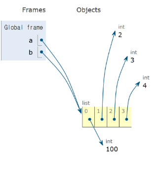
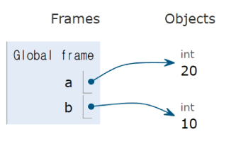
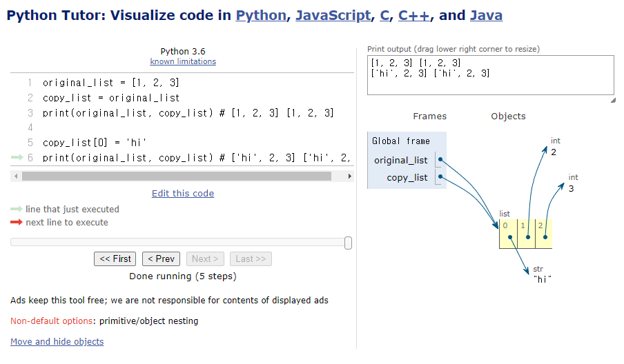
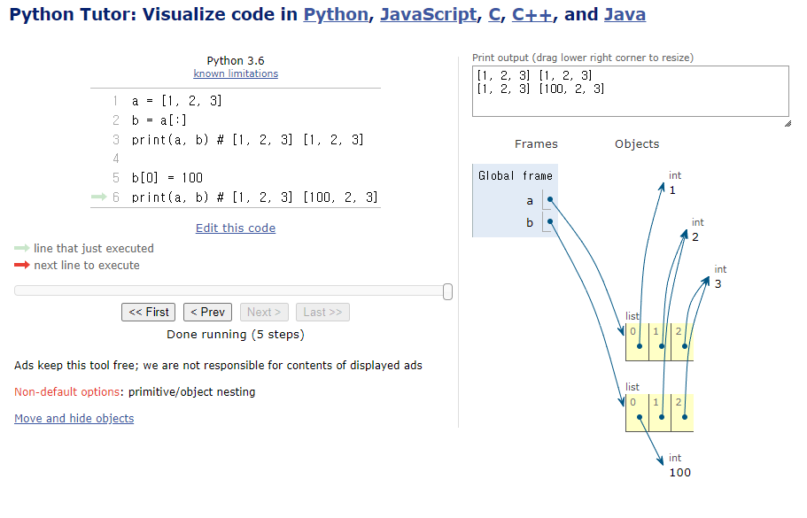
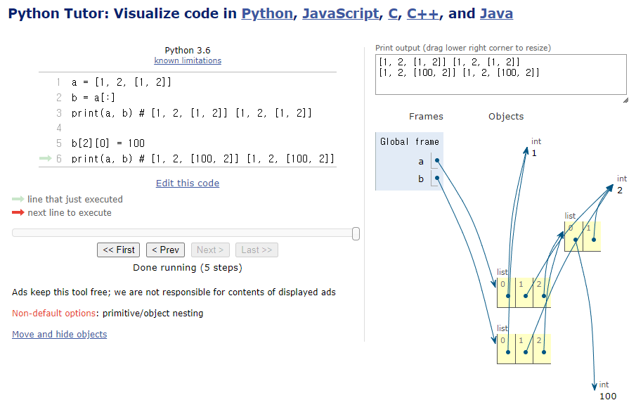
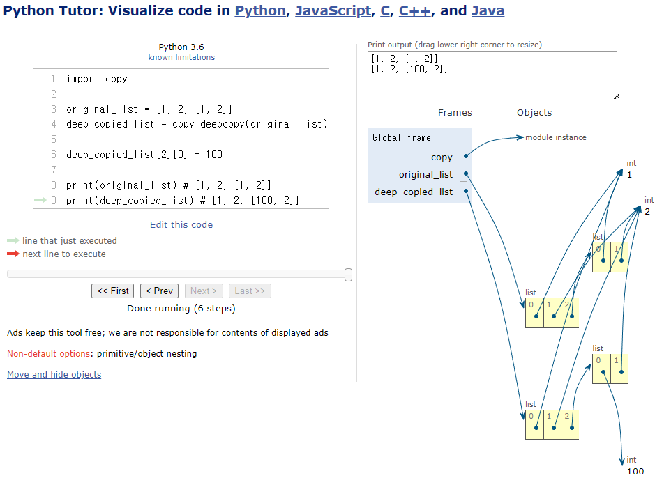

# 복사

- 데이터 타입과 복사
    - 파이썬에서는 데이터의 분류에 따라 복사가 달라짐
    - “변경 가능한 데이터 타입”과 “변경 불가능한 데이터 타입”을 다르게 다룸
- 변경 가능한 데이터 타입의 복사
    
    
    ```python
    a = [1, 2, 3, 4]
    b = a
    b[0] = 100
    
    print(a) # [100, 2, 3, 4]
    print(b) # [100, 2, 3, 4]
    ```
    
    
    
- 변경 불가능한 데이터 타입의 복사
    
    
    ```python
    a = 20
    b = a
    b = 10
    
    print(a) # 20 
    print(b) # 10
    ```
    
    
    
- 복사유형
    - 할당 (Assignment)
    - 얕은 복사 (Shallow copy)
    - 깊은 복사 (Deep copy)
1. 할당 (Assignment)
    - 리스트 복사 예시
        
        ```python
        original_list = [1, 2, 3]
        copy_list = original_list
        print(original_list, copy_list) # [1, 2, 3] [1, 2, 3]
        
        copy_list[0] = 'hi'
        print(original_list, copy_list) # ['hi', 2, 3] ['hi', 2, 3]
        ```
        
        - 할당 연산자(=)를 통한 복사는 해당 객체에 대한 객체 참조를 복사
            
            
            
2. 얕은 복사 (Shallow copy)
    - 리스트 얕은 복사 예시
        
        ```python
        # slicing
        a = [1, 2, 3]
        b = a[:]
        print(a, b) # [1, 2, 3] [1, 2, 3]
        
        b[0] = 100
        print(a, b) # [1, 2, 3] [100, 2, 3]
        
        # copy module
        import copy
        a = [1, 2, 3]
        b = copy.copy(a)
        print(a, b) # [1, 2, 3] [1, 2, 3]
        
        b[0] = 100
        print(a, b) # [1, 2, 3] [100, 2, 3]
        ```
        
        - 슬라이싱을 통해 생성된 객체는 원본 객체와 독립적으로 존재
            
            
            
    - 얕은 복사의 한계
        - 2차원 리스트와 같이 변경가능한 객체 안에 변경 가능한 객체가 있는 경우
            
            ```python
            a = [1, 2, [1, 2]]
            b = a[:]
            print(a, b) # [1, 2, [1, 2]] [1, 2, [1, 2]]
            
            b[2][0] = 100
            print(a, b) # [1, 2, [100, 2]] [1, 2, [100, 2]]
            ```
            
        - a와 b의 주소는 다르지만 내부 객체의 주소는 같기 때문에 함께 변경됨
            
            
            
3. 깊은 복사 (Deep copy)
    - 리스트 깊은 복사 예시
        
        ```python
        import copy
        
        original_list = [1, 2, [1, 2]]
        deep_copied_list = copy.deepcopy(original_list)
        
        deep_copied_list[2][0] = 100
        
        print(original_list) # [1, 2, [1, 2]]
        print(deep_copied_list) # [1, 2, [100, 2]]
        ```
        
        - 내부에 중첩된 모든 객체까지 새로운 객체 주소를 참조하도록 함
            
            