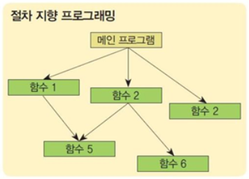
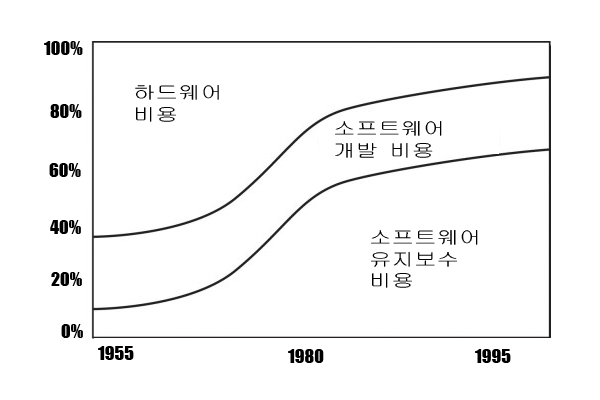
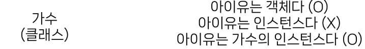
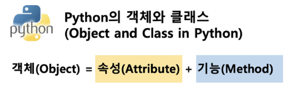

# 객체지향 프로그래밍

- **절차 지향 프로그래밍 (Procedural Programming)**
  : 프로그램을 “데이터”와 “절차”로 구성하는 방식의 프로그래밍 패러다임
  - 절차 지향 프로그래밍 특징
    - **_“데이터”와 해당 데이터를 처리하는 “함수(절차)”가 분리_**되어 있으며, **_함수 호출의 흐름이 중요_**
    - 코드의 순차적인 흐름과 함수 호출에 의해 프로그램이 진행
    - 실제로 실행되는 내용이 무엇이 무엇인가가 중요
    - 데이터를 다시 재사용하거나 하기보다는 처음부터 끝까지 실행되는 결과물이 중요한 방식
      
  - 소프트웨어 위기 (Software Crisis)
    - 하드웨어의 발전으로 컴퓨터 계산용량과 문제의 복잡성이 급격히 증가함에 따라 소프트웨어에 발생한 충격
      
- 객체 지향 프로그래밍 (Object Oriented Programming)
  : 데이터와 해당 데이터를 조작하는 메서드를 하나의 객체로 묶어 관리하는 방식의 프로그래밍 패러다임
  - 절차 지향 vs 객체 지향
    | 절차지향 | 객체지향 |
    | --------------------------------------------------- | -------- |
    | - 데이터와 해당 데이터를 처리하는 함수(절차)가 분리 | - 데이터와 해당 데이터를 처리하는 메서드(메시지)를 하나의 객체(클래스)로 묶음|
    | - 함수 호출의 흐름이 중요 | - 객체 간 상호작용과 메시지 전달이 중요
    | - 절차지향의 주체는 함수 | - 객체지향의 주체는 데이터(객체) |

# 객체

**클래스 (Class)** : 파이썬에서 **_타입을 표현_**하는 방법

→ **_객체를 생성하기 위한 설계도_** (블루프린트)

→ **_데이터와 기능(메서드)을 함께 묶는 방법_**을 제공

**객체 (Object)** : 클래스에서 정의한 것을 토대로 **_메모리에 할당된 것_**

→ ‘속성’과 ‘행동’으로 구성된 모든 것

> 클래스와 객체 예시
>
> - **클래스로 만든 객체**를 **인스턴스**라고도 함
>     
>     
>     클래스를 만든다 == **타입**을 만든다
>
>
> ```python
> name = "Alice"
> print(type(name)) # <class 'str'>
> ```
>
> - 변수 name의 타입은 str 클래스다.
>   → 변수 name은 str 클래스의 인스턴스이다.
>   ∴ 우리가 사용해왔던 *데이터 타입은 사실 모두 클래스*였다.
> - `‘ ‘`, `‘hello’`, `‘파이썬’`
>   : 문자열 타입(클래스)의 객체(인스턴스)
> - `[1, 2, 3]`, `[1]`, `[]`, `[’hi’]`
>   : 리스트 타입(클래스)의 객체(인스턴스)

> 인스턴스와 메서드 예시
>
> - `“hello”.upper()` → 인스턴스.메서드()
> - `[1, 2, 3].sort()` → 인스턴스.메서드()

**_하나의 객체(object)는 특정 타입의 인스턴스(instance)이다._**

ex) 123, 900, 5는 모두 int의 인스턴스, ‘hello’, ‘bye’는 모두 string의 인스턴스, [232, 89, 1], []는 모두 list의 인스턴스

- 객체(object)의 특징
  - 타입(type) : 어떤 연산자(operator)와 조작(method)이 가능한가?
  - 속성(attribute) : 어떤 상태(데이터)를 가지는가?
  - 조작법(method) : 어떤 행위(함수)를 할 수 있는가?
      
