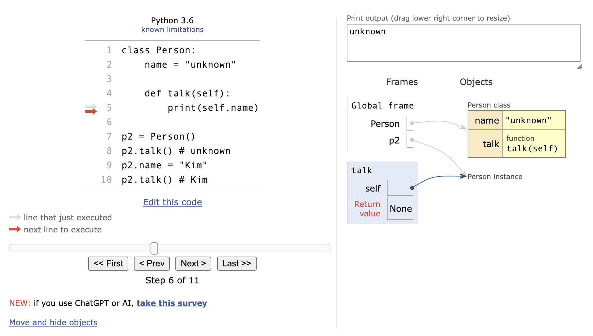
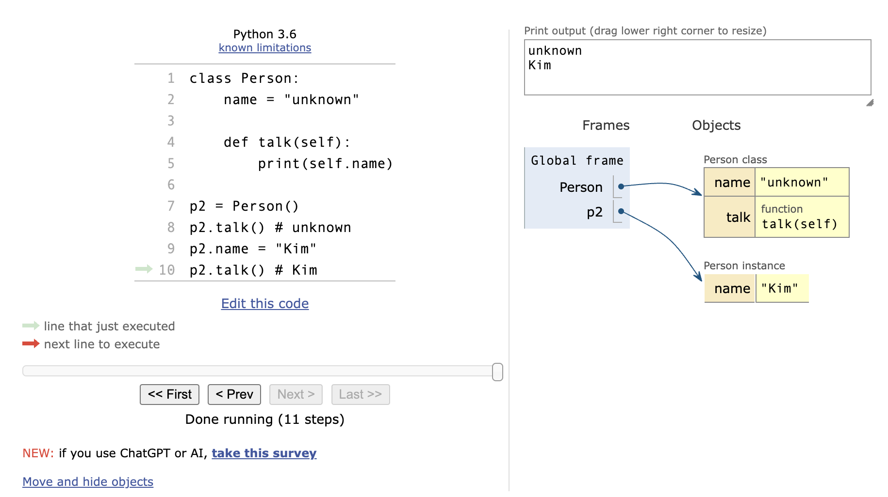

# Class

**클래스 (Class)** : 파이썬에서 **_타입을 표현_**하는 방법

→ **_객체를 생성하기 위한 설계도_** (블루프린트)

→ **_데이터와 기능(메서드)을 함께 묶는 방법_**을 제공

- 클래스 구조
  ```python
  # 클래스 정의
  class Person:
  	pass

  # 인스턴스 생성
  iu = Person()

  # 메서드 호출
  iu.메서드()

  # 속성(변수) 접근
  iu.attribute
  ```
- 클래스 기본 활용
  ```python
  # 클래스 정의
  class Person:
  	blood_color = 'red'

  	def __init__(self, name):
  		self.name = name

  	def singing(self):
  		return f'{self.name}가 노래합니다.'
  ```
  ```python
  # 인스턴스 생성
  singer1 = Person('iu')

  # 메서드 호출
  print(singer1.singing()) # iu가 노래합니다.

  # 속성(변수) 접근
  print(singer1.blood_color) # red
  ```
  - 생성자 함수
    - 객체를 생성할 때 자동으로 호출되는 특별한 메서드
    - `__init__` 이라는 이름의 메서드로 정의되며, 객체의 초기화를 담당
    - 생성자 함수를 통해 인스턴스를 생성하고 필요한 초기값을 설정
      ```python
      class Person:
      	blood_color = 'red'

      	def __init__(self, name):
      		self.name = name

      	def singing(self):
      		return f'{self.name}가 노래합니다.'
      ```
  - 인스턴스 변수
    - 인스턴스(객체)마다 별도로 유지되는 변수
    - 인스턴스마다 독립적인 값을 가지며, 인스턴스가 생성될 때마다 초기화 됨
      ```python
      class Person:
      	blood_color = 'red'

      	def __init__(self, name):
      		self.name = name

      	def singing(self):
      		return f'{self.name}가 노래합니다.'

      singer1 = Person('iu')
      # 인스턴스 변수
      print(singer1.name) # iu
      ```
  - 클래스 변수
    - 클래스 내부에 선언된 변수
    - 클래스로 생성된 모든 인스턴스들이 공유하는 변수
      ```python
      class Person:
      	blood_color = 'red'

      	def __init__(self, name):
      		self.name = name

      	def singing(self):
      		return f'{self.name}가 노래합니다.'

      singer1 = Person('iu')
      # 클래스 속성(변수) 접근
      print(singer1.blood_color) # red
      ```
  - 인스턴스 메서드
    - 각각의 인스턴스에서 호출할 수 있는 메서드
    - 인스턴스 변수에 접근하고 수정하는 등의 작업을 수행
      ```python
      class Person:
      	blood_color = 'red'

      	def __init__(self, name):
      		self.name = name

      	def singing(self):
      		return f'{self.name}가 노래합니다.'

      singer1 = Person('iu')
      # 인스턴스 메서드 호출
      print(singer1.singing()) # iu가 노래합니다.
      ```
  - 인스턴스와 클래스 간의 이름 공간(namespace)
    - 클래스를 정의하면, 클래스와 해당하는 이름 공간 생성
    - 인스턴스를 만들면, 인스턴스 객체가 생성되고 독립적인 이름 공간 생성
    - 인스턴스에서 특정 속성에 접근하면, 인스턴스 → 클래스 순으로 탐색
    ```python
    class Person:
    	name = "unknown"

    	def talk(self):
    		print(self.name)

    p1 = Person()
    p1.talk() # unknown

    # p2 인스턴스 변수 설정 전/후
    p2 = Person()
    p2.talk() # unknown
    p2.name = "Kim"
    p2.talk() # Kim

    print(Person.name) # unknown
    print(p1.name) # unknown
    print(p2.name) # Kim
    ```
      
      
      

  - 독립적인 이름공간을 가지는 이점
    - 각 인스턴스는 독립적인 메모리 공간을 가지며, 클래스와는 다른 인스턴스 간에는 서로의 데이터나 상태에 직접적인 접근이 불가능
    - 객체 지향 프로그래밍의 중요한 특성 중 하나로, 클래스와 인스턴스를 모듈화하고, 각각의 객체가 독립적으로 동작하도록 보장
    - 이를 통해 클래스와 인스턴스는 다른 객체들과의 상호작용에서 서로 충돌이나 영향을 주지 않으면서 독립적으로 동작할 수 있음
    - 코드의 가독성, 유지보수성, 재사용성을 높이는데 도움을 줌
- 인스턴스 변수와 클래스 변수
  - 클래스 변수 활용
    - 가수가 몇 명인지 확인하고 싶다면?
      → 인스턴스가 생성 될 때마다 클래스 변수가 늘어나도록 설정할 수 있음
      ```python
      class Person:
      	count = 0

      	def __init__(self, name):
      		self.name = name
      		Person.name += 1

      person1 = Person('iu')
      person2 = Person('BTS')

      print(Person.count) # 2
      ```
    - 클래스 변수를 변경할 때는 항상 `클래스.클래스변수` 형식으로 변경
      ```python
      class Circle:
      	pi = 3.14

      	def __init__(self, r):
      		self.r = r

      c1 = Circle(5)
      c2 = Circle(10)

      print(Circle.pi) # 3.14
      print(c1.pi) # 3.14
      print(c2.pi) # 3.14

      c2.pi = 5 # 인스턴스 변수 변경
      print(Circle.pi) # 3.14 (클래스 변수)
      print(c1.pi) # 3.14 (클래스 변수)
      print(c2.pi) # 5 (새로운 인스턴스 변수가 생성됨)

      Circle.pi = 5 # 클래스 변수 변경
      print(Circle.pi) # 5
      print(c1.pi) # 5
      print(c2.pi) # 5
      ```
